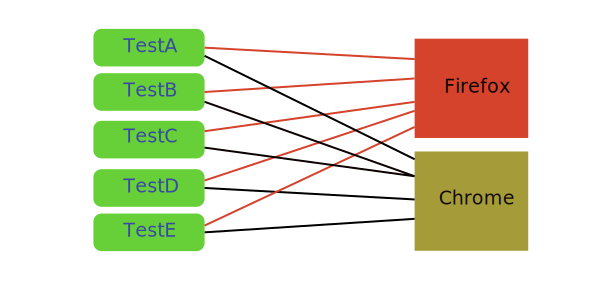
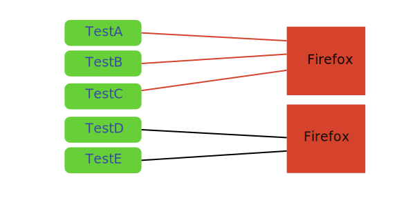

# Multiple and Parallel Testing

Multiple is a way to run the same set of tests using different browsers.

Parallel testing is when many instances of the same browser are used at the same time to cut down on execution time.

These two concepts can be combined.

## Multiple Browsers Execution



This is useful if you want to execute same tests but on different browsers and with different configurations or different tests on same browsers in parallel.

Create `multiple` section in configuration file, and fill it with run suites. Each suite should have `browser` array with browser names or driver helper's configuration:
```js
"multiple": {
  "basic": {
    // run all tests in chrome and firefox
    "browsers": ["chrome", "firefox"]
  },

  "smoke": {
    "browsers": [
      "firefox",
      // replace any config values from WebDriver helper
      {
        "browser": "chrome",
        "windowSize": "maximize",
        "desiredCapabilities": {
          "acceptSslCerts": true
        }
      },
    ]
  },
}
```

You can use `grep` and `outputName` params to filter tests and output directory for suite:
```js
"multiple": {
  "smoke": {
    // run only tests containing "@smoke" in name
    "grep": "@smoke",

    // store results into `output/smoke` directory
    "outputName": "smoke",

    "browsers": [
      "firefox",
      {"browser": "chrome", "windowSize": "maximize"}
    ]
  }
}
```

Then tests can be executed using `run-multiple` command.

Run all suites for all browsers:

```sh
codeceptjs run-multiple --all
```

Run `basic` suite for all browsers

```sh
codeceptjs run-multiple basic
```

Run `basic` suite for chrome only:

```sh
codeceptjs run-multiple basic:chrome
```

Run `basic` suite for chrome and `smoke` for firefox

```sh
codeceptjs run-multiple basic:chrome smoke:firefox
```

Run basic tests with grep and junit reporter

```sh
codeceptjs run-multiple basic --grep signin --reporter mocha-junit-reporter
```

Run regression tests specifying different config path:

```sh
codeceptjs run-multiple regression -c path/to/config
```

Each executed process uses custom folder for reports and output. It is stored in subfolder inside an output directory. Subfolders will be named in `suite_browser` format.

Output is printed for all running processes. Each line is tagged with a suite and browser name:

```sh
[basic:firefox] GitHub --
[basic:chrome] GitHub --
[basic:chrome]    it should not enter
[basic:chrome]  ✓ signin in 2869ms

[basic:chrome]   OK  | 1 passed   // 30s
[basic:firefox]    it should not enter
[basic:firefox]  ✖ signin in 2743ms

[basic:firefox] -- FAILURES:
```

### Hooks

Hooks are available when using the `run-multiple` command to perform actions before the test suites start and after the test suites have finished. See [Hooks](hooks.md#bootstrap-teardown) for an example.

## Parallel Execution



CodeceptJS can be configured to run tests in parallel.

When enabled, it collects all test files and executes them in parallel by the specified amount of chunks. Given we have five test scenarios (`a_test.js`,`b_test.js`,`c_test.js`,`d_test.js` and `e_test.js`), by setting `"chunks": 2` we tell the runner to run two suites in parallel. The first suite will run `a_test.js`,`b_test.js` and `c_test.js`, the second suite will run `d_test.js` and `e_test.js`.


```js
"multiple": {
  "parallel": {
    // Splits tests into 2 chunks
    "chunks": 2
  }
}
```

To execute them use `run-multiple` command passing configured suite, which is `parallel` in this example:

```
codeceptjs run-multiple parallel
```

Grep and multiple browsers are supported. Passing more than one browser will multiply the amount of suites by the amount of browsers passed. The following example will lead to four parallel runs.

```js
"multiple": {
  // 2x chunks + 2x browsers = 4
  "parallel": {
    // Splits tests into chunks
    "chunks": 2,
    // run all tests in chrome and firefox
    "browsers": ["chrome", "firefox"]
  },
}
```

Passing a function will enable you to provide your own chunking algorithm. The first argument passed to you function is an array of all test files, if you enabled grep the test files passed are already filtered to match the grep pattern.

```js
"multiple": {
  "parallel": {
    // Splits tests into chunks by passing an anonymous function,
    // only execute first and last found test file
    "chunks": (files) => {
      return [
        [ files[0] ], // chunk 1
        [ files[files.length-1] ], // chunk 2
      ]
    },
    // run all tests in chrome and firefox
    "browsers": ["chrome", "firefox"]
  }
}
```

Note: Chunking will be most effective if you have many individual test files that contain only a small amount of scenarios. Otherwise the combined execution time of many scenarios or big scenarios in one single test file potentially lead to an uneven execution time.

