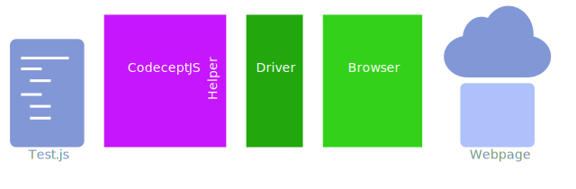

# QuickStart

CodeceptJS is multi-backend testing framework. It can execute tests using different libraries like webdriverio, Puppeteer, Protractor, etc. Note that these libraries need to be installed separately - they are not included in the CodeceptJS package.

CodeceptJS is an acceptance testing framework. In the diversified world of JavaScript testing libraries it aims to create a unified high level API for end-to-end testing, powered by different backends.

CodeceptJS allows you to write a test and switch in config execution drivers: will it be *wedriverio*, *puppeteer*, or *protractor* depends on you.
This way you aren't be bound to implementation, and your acceptance tests will work no matter which framework is running them.



CodeceptJS contains **helpers** that talk to **drivers**. The drivers control a **browser**, usually in headless mode - which means that the browser window is not visible while the test is running.

You need to install
* Node and Node Package Manager (NPM)
* CodeceptJS
* A browser
* A suitable driver (webdriver, puppeteer, protractor, nightmare)

You need to provide 
* a web page to test
* a test script

CodeceptJS takes care of connecting your test script to the browser through a helper and its corresponding driver.


## NodeJS v8.9

**NodeJS v 8.9** and higher required to start. Using an older version of NodeJS will result in errors.
Check your Node version on the command-line

```sh
> node --version
v8.11.1
```

## Quickstarts

There are separate Quickstarts for all the major drivers:

* [Puppeteer Quickstart](puppeteer.md)
* [Selenium WebDriver Quickstart](selenium.md)
* [Protractor Quickstart](protractor.md)
* [Nightmare Quickstart](nightmare.md)

All of the quickstarts show you how to test GitHub.


## CodeceptJS in 2 minutes

<video onclick="this.paused ? this.play() : this.pause();" src="/images/codeceptjs-install.mp4" style="width: 100%" controls></video>

---

### Next: [Puppeteer Quickstart >>>](puppeteer.md)
