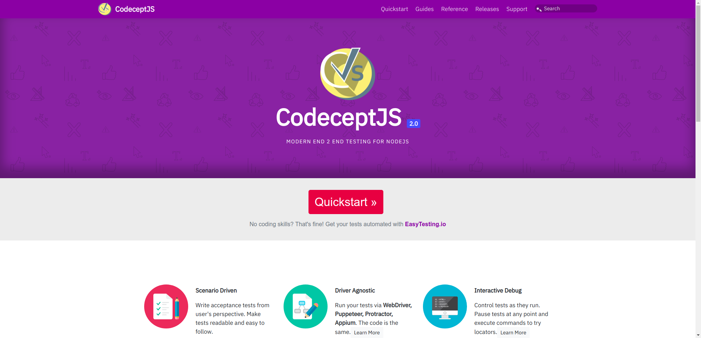
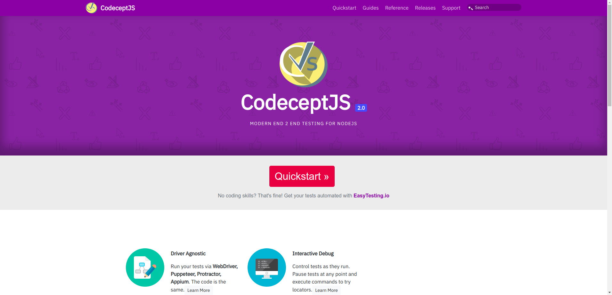
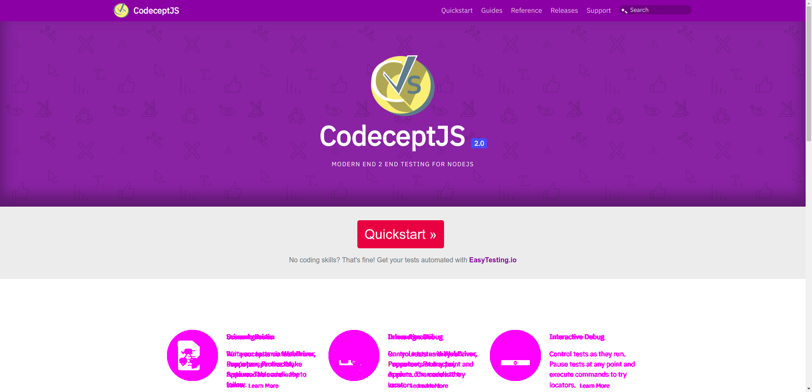

# Visual Testing

How does one test if the UI being rendered appears correctly to the users or how to test if each UI element appears in the right position and size? The traditional way to test the UI of the application has always been manually, which is time consuming.

Visual testing with help of CodeceptJS will help in improving such use cases for the QA folks.

By default CodeceptJS uses [WebDriver](/helpers/WebDriver/) helper and **Selenium** to automate browser. It is also capable of taking screenshots of the application and this could be used for visual testing.

Currently there are two helpers available for Visual testing with CodeceptJS

## Using Resemble helper
[Resemble.js](https://github.com/rsmbl/Resemble.js) is a great tool for image comparison and analysis, which can be used with CodeceptJS
###Setup
To install the package, just run `npm install codeceptjs-resemblehelper`
###Configuring
This helper should be added in codecept.json/codecept.conf.js

Example:

```json
{
   "helpers": {
     "ResembleHelper" : {
       "require": "codeceptjs-resemblehelper",
       "screenshotFolder" : "./tests/output/",
       "baseFolder": "./tests/screenshots/base/",
       "diffFolder": "./tests/screenshots/diff/"
     }
   }
}
```

To use the Helper, users must provide the three parameters:

`screenshotFolder` : This will always have the same value as `output` in Codecept configuration, this is the folder where webdriverIO
saves a screenshot when using `I.saveScreenshot` method

`baseFolder`: This is the folder for base images, which will be used with screenshot for comparison

`diffFolder`: This will the folder where resemble would try to store the difference image, which can be viewed later.

### Usage
Details about the helper can be found on the [Github Repo](https://github.com/puneet0191/codeceptjs-resemblehelper)

Base Image is compared with the screenshot image and test results are derived based on the `mismatch tolerance` level provided by the user for the comparison

###Example
Lets consider visual testing for [CodeceptJS Home](http://codecept.io)

```js
Feature('To test screen comparison with resemble Js Example test');

Scenario('Compare CodeceptIO Home Page @visual-test', async (I, adminPage) => {
    I.amOnPage("/");
    I.saveScreenshot("Codecept_IO_Screenshot_Image.png");
    I.seeVisualDiff("Codecept_IO_Screenshot_Image.png", {tolerance: 2, prepareBaseImage: false});
});
```
In this example, we are setting the expected mismatch tolerance level as `2`

`Base Image` (Generated by User)


`Screenshot Image` (Generated by Test)


Clearly the difference in both the images visible to human eye is the section about `Scenario Driven`



`Diff Image` generated by the helper clearly highlights the section which don't match


`Failed Test output`
```
To test screen comparison with resemble Js Example test --
  Compare CodeceptIO Home Page @visual-test
    I see Visual Diff "Codecept_IO_Screenshot_Image.png", {tolerance: 2, prepareBaseImage: false}
MisMatch Percentage Calculated is 2.85
  ✖ FAILED in 418ms


-- FAILURES:

  1) To test screen comparison with resemble Js Example test
       Compare CodeceptIO Home Page @visual-test:

      MissMatch Percentage 2.85
      + expected - actual

      -false
      +true
```

`Codeceptjs-resemblehelper` basically comes with two major functions

1) `seeVisualDiff` which can be used to compare two images and calculate the misMatch percentage.
2) `seeVisualDiffForElement` which can be used to compare elements on the two images and calculate misMatch percentage.

## Using Visual Knight

---

### done()
